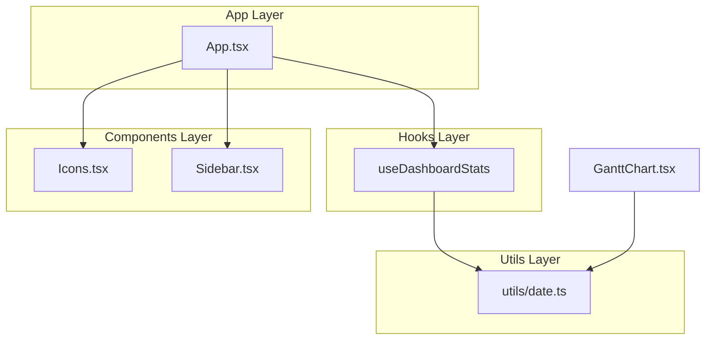
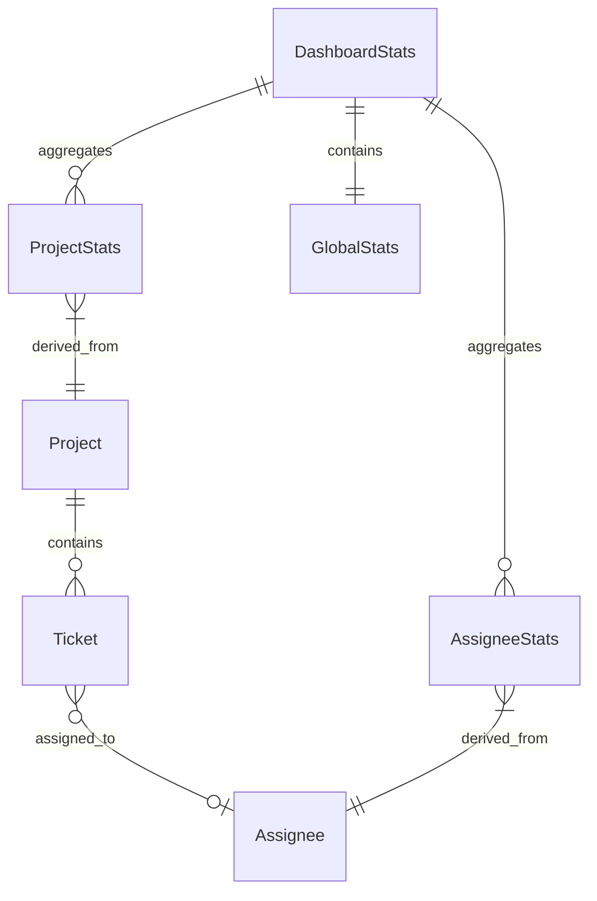

# Design Document: Dashboard Status

## Overview

**Purpose**: ホーム画面のダッシュボードを拡張し、進行中プロジェクトの詳細な状況とチケットの期限管理情報を一目で把握できるようにする。プロジェクトマネージャーやチームメンバーが迅速にプロジェクト健全性を評価し、リスクを早期に特定できるようにする。

**Users**: プロジェクトマネージャー、チームメンバー、経営層がダッシュボードを通じてプロジェクト全体の進捗状況を確認し、タイムライン画面への遷移を行う。

**Impact**: 既存のダッシュボード（App.tsx:610-677行）を拡張し、統計セクションの追加と進行中プロジェクトカードの情報拡充を行う。新規カスタムフックとユーティリティファイルを追加する。

### Goals
- 進行中プロジェクトごとの詳細なチケット状況を表示
- 期限超過・期限間近のチケットを警告表示
- 担当者別のチケット分布を可視化
- 全体統計情報の拡充

### Non-Goals
- チケットの編集・作成機能（既存タイムライン画面で対応）
- グラフ/チャートによる可視化（将来の拡張）
- リアルタイム更新機能
- 通知機能

## Architecture

### Existing Architecture Analysis

**現在の構造**:
- `App.tsx`: 単一ファイルに全ステート・ロジック・UIを集約（894行）
- ダッシュボードセクション（610-677行）: 基本統計カード4つ + 進行中プロジェクトカード
- コンポーネント分離: Sidebar, Modal, TicketList, GanttChart, Icons
- ステート管理: useState + useMemo + useCallback（外部ライブラリ不使用）

**尊重すべきパターン**:
- useMemoによる計算結果のメモ化
- Tailwind CSSによるスタイリング（ダークモード対応）
- Discriminated Union型によるモーダル状態管理

**解消する技術的課題**:
- App.tsxの肥大化防止 → 集計ロジックをカスタムフックに分離

### Architecture Pattern & Boundary Map



**Architecture Integration**:
- **Selected pattern**: カスタムフックによるロジック分離（ハイブリッドアプローチ）
- **Domain boundaries**: 集計ロジック（useDashboardStats） / 日付計算（utils/date.ts） / UI（App.tsx）
- **Existing patterns preserved**: useMemo、useCallback、Tailwind CSS、既存コンポーネント構造
- **New components rationale**:
  - `useDashboardStats`: 複雑な集計ロジックをApp.tsxから分離し、テスタビリティ向上
  - `utils/date.ts`: GanttChartとダッシュボードで共通の日付計算を共有
  - `ExclamationTriangleIcon`: 警告表示用アイコン追加

### Technology Stack

| Layer | Choice / Version | Role in Feature | Notes |
|-------|------------------|-----------------|-------|
| Frontend | React 19.2.0 | UIレンダリング、フック活用 | 既存バージョン維持 |
| スタイリング | Tailwind CSS | レスポンシブ・ダークモード対応 | 既存パターン踏襲 |
| 型システム | TypeScript 5.8.2 | 型安全な集計インターフェース | strict mode |
| ビルド | Vite 6.2.0 | 開発・本番ビルド | 既存設定維持 |

## Requirements Traceability

| Requirement | Summary | Components | Interfaces | Flows |
|-------------|---------|------------|------------|-------|
| 1.1 | チケット数・親チケット数表示 | useDashboardStats, App.tsx | ProjectStats | Dashboard表示 |
| 1.2 | 期間情報表示 | App.tsx | - | Dashboard表示 |
| 1.3 | 残日数/超過日数表示 | useDashboardStats, utils/date.ts | ProjectStats | Dashboard表示 |
| 1.4 | カード形式配置 | App.tsx | - | Dashboard表示 |
| 2.1 | チケット総数表示 | useDashboardStats | ProjectStats | Dashboard表示 |
| 2.2 | 担当者別チケット数 | useDashboardStats | AssigneeStats | Dashboard表示 |
| 2.3 | 未割り当て数表示 | useDashboardStats | ProjectStats | Dashboard表示 |
| 3.1 | 7日以内期限チケット | useDashboardStats, utils/date.ts | ProjectStats | Dashboard表示 |
| 3.2 | 期限超過警告表示 | useDashboardStats, App.tsx | ProjectStats | Dashboard表示 |
| 3.3 | 警告アイコン表示 | Icons.tsx, App.tsx | - | Dashboard表示 |
| 4.1 | カードクリック遷移 | App.tsx | - | 画面遷移 |
| 4.2 | 警告エリアクリック遷移 | App.tsx | - | 画面遷移 |
| 4.3 | リンクボタン表示 | App.tsx | - | Dashboard表示 |
| 5.1 | 総チケット数表示 | useDashboardStats | GlobalStats | Dashboard表示 |
| 5.2 | 担当者稼働状況 | useDashboardStats | AssigneeStats | Dashboard表示 |
| 5.3 | 既存統計維持 | App.tsx | - | Dashboard表示 |

## Components and Interfaces

| Component | Domain/Layer | Intent | Req Coverage | Key Dependencies | Contracts |
|-----------|--------------|--------|--------------|------------------|-----------|
| useDashboardStats | Hooks | ダッシュボード用集計データ算出 | 1.1, 1.3, 2.1-2.3, 3.1-3.2, 5.1-5.2 | utils/date.ts (P0) | State |
| utils/date.ts | Utils | 日付計算ユーティリティ | 1.3, 3.1, 3.2 | なし | Service |
| ExclamationTriangleIcon | Components/Icons | 警告アイコン表示 | 3.3 | なし | - |
| App.tsx (Dashboard部) | UI | ダッシュボードUI表示 | 1.2, 1.4, 4.1-4.3, 5.3 | useDashboardStats (P0) | - |

### Hooks Layer

#### useDashboardStats

| Field | Detail |
|-------|--------|
| Intent | プロジェクト・チケット・担当者の集計データを算出し、メモ化して提供 |
| Requirements | 1.1, 1.3, 2.1, 2.2, 2.3, 3.1, 3.2, 5.1, 5.2 |

**Responsibilities & Constraints**
- プロジェクトごとのチケット統計を計算
- 期限関連の集計（超過、7日以内）を算出
- 担当者別チケット分布を計算
- useMemoによる計算結果のメモ化を保証

**Dependencies**
- Inbound: App.tsx — projects, tickets, assignees配列を受け取る (P0)
- Outbound: utils/date.ts — diffInDays関数を使用 (P0)

**Contracts**: State [x]

##### State Management

```typescript
interface ProjectStats {
  projectId: string;
  totalTickets: number;
  parentTickets: number;
  overdueTickets: number;
  dueSoonTickets: number;  // 7日以内
  unassignedTickets: number;
  assigneeBreakdown: Map<string, number>;
  daysRemaining: number | null;  // null = 終了日未設定
}

interface GlobalStats {
  totalTickets: number;
  totalOverdue: number;
  totalDueSoon: number;
}

interface AssigneeStats {
  assigneeId: string;
  assigneeName: string;
  ticketCount: number;
}

interface DashboardStats {
  projectStats: Map<string, ProjectStats>;
  globalStats: GlobalStats;
  assigneeStats: AssigneeStats[];
}

// Hook signature
function useDashboardStats(
  projects: Project[],
  tickets: Ticket[],
  assignees: Assignee[]
): DashboardStats;
```

- **State model**: 読み取り専用の集計結果（派生状態）
- **Persistence**: なし（オンメモリ計算）
- **Concurrency strategy**: useMemoによる依存配列ベースの再計算

**Implementation Notes**
- Integration: App.tsxのダッシュボードセクションから呼び出し
- Validation: 空配列の場合はデフォルト値を返す
- Risks: 大量チケット時のパフォーマンス → useMemoで軽減

### Utils Layer

#### utils/date.ts

| Field | Detail |
|-------|--------|
| Intent | 日付計算の共通ユーティリティを提供 |
| Requirements | 1.3, 3.1, 3.2 |

**Responsibilities & Constraints**
- 日付間の日数差を計算
- 日付への日数加算を計算
- 時間帯に依存しない計算（00:00:00に正規化）

**Dependencies**
- External: なし（純粋関数）

**Contracts**: Service [x]

##### Service Interface

```typescript
/**
 * 2つの日付間の日数差を計算
 * @param date1 基準日
 * @param date2 比較日
 * @returns date1 - date2 の日数（正: date1が未来、負: date1が過去）
 */
function diffInDays(date1: Date, date2: Date): number;

/**
 * 日付に日数を加算
 * @param date 基準日
 * @param days 加算日数（負の値で減算）
 * @returns 新しいDateオブジェクト
 */
function addDays(date: Date, days: number): Date;

/**
 * 今日の日付を取得（時刻を00:00:00に正規化）
 * @returns 正規化された今日のDate
 */
function getToday(): Date;
```

- Preconditions: 有効なDateオブジェクト
- Postconditions: 新しいDateオブジェクトを返す（入力を変更しない）
- Invariants: 時刻は00:00:00に正規化

**Implementation Notes**
- Integration: GanttChart.tsxの既存関数を移動し、両方から参照
- Validation: Date型チェック不要（TypeScriptで保証）
- Risks: タイムゾーン問題 → setHours(0,0,0,0)で軽減

### Components Layer

#### ExclamationTriangleIcon

| Field | Detail |
|-------|--------|
| Intent | 期限超過警告を視覚的に表示 |
| Requirements | 3.3 |

**Implementation Notes**
- 既存Icons.tsxのパターンに準拠
- Heroicons（outline）スタイルを使用
- className propでサイズ・色をカスタマイズ可能

## Data Models

### Domain Model

既存のドメインモデル（Project, Ticket, Assignee）を変更せず、派生データとして集計結果を算出する。

**Aggregates**:
- `DashboardStats`: ダッシュボード表示用の集計結果（読み取り専用）

**Business Rules**:
- 期限超過: `ticket.endDate < today`
- 期限間近: `today <= ticket.endDate <= today + 7days`
- 残日数: `project.endDate - today`（終了日未設定時はnull）
- 親チケット: `ticket.parentId === null`

### Logical Data Model



**Structure Definition**:
- `DashboardStats`: プロジェクト統計のMap + 全体統計 + 担当者統計配列
- `ProjectStats`: プロジェクトID紐付きの集計データ
- `GlobalStats`: 全プロジェクト横断の集計データ
- `AssigneeStats`: 担当者ごとの集計データ

## Error Handling

### Error Strategy

フロントエンドのみの機能であり、外部APIやデータベースへのアクセスがないため、エラーハンドリングは最小限。

### Error Categories and Responses

**User Errors**: 該当なし（表示専用機能）

**System Errors**:
- 空データの場合: デフォルト値（0件、空配列）を表示
- 日付計算エラー: 防御的プログラミング（null/undefinedチェック）

**Business Logic Errors**: 該当なし

### Monitoring

- コンソールログ: 開発時のデバッグ用（本番では無効化）
- React DevTools: useMemoの再計算確認

## Testing Strategy

### Unit Tests
- `useDashboardStats`: 各集計ロジックの正確性
  - 空配列入力時のデフォルト値
  - 期限超過チケットのカウント
  - 担当者別集計の正確性
- `utils/date.ts`: 日付計算関数
  - diffInDaysの正負テスト
  - addDaysの境界値テスト
  - タイムゾーン正規化の検証

### Integration Tests
- ダッシュボード表示の統合テスト
  - 統計カードの値が正しく表示される
  - プロジェクトカードに警告アイコンが表示される
  - クリックでタイムライン画面に遷移する

### E2E Tests
- ダッシュボード → タイムライン遷移フロー
- 統計情報の表示確認

## Performance & Scalability

**Target metrics**:
- 初期レンダリング: 100ms以内
- 集計計算: 50ms以内（100プロジェクト、1000チケット想定）

**Optimization techniques**:
- useMemoによる集計結果のメモ化
- 依存配列の適切な設定で不要な再計算を防止
- Map/Setによる効率的なルックアップ
